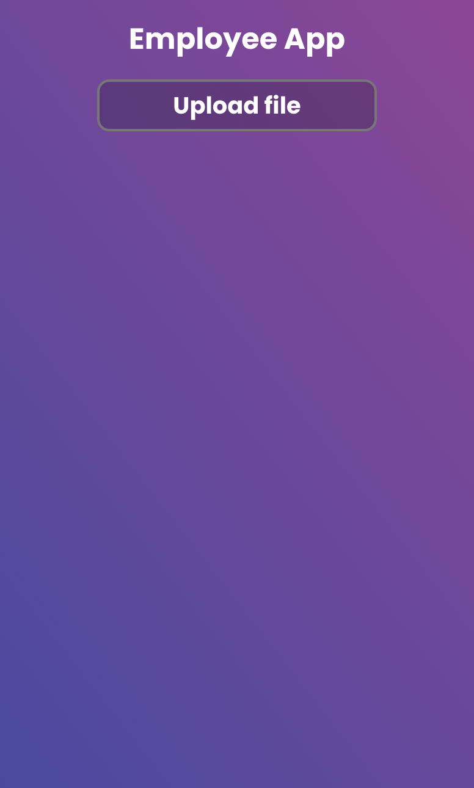
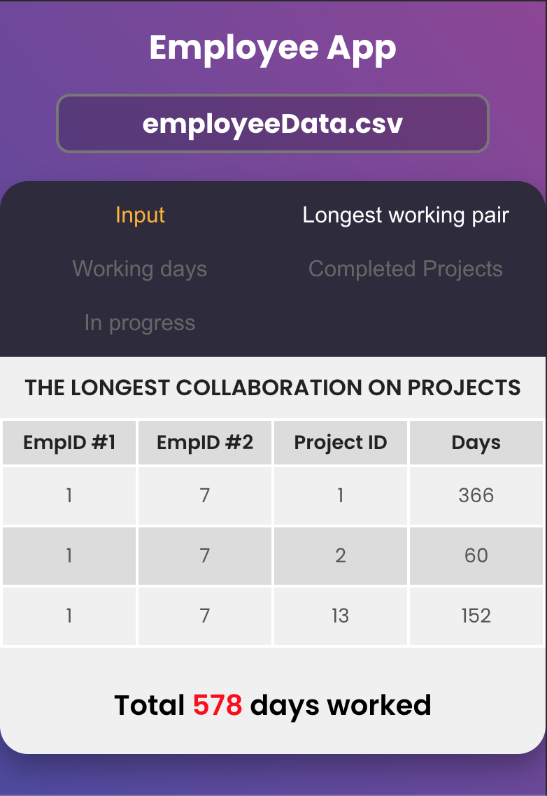

# Employee App

You can view the site here
[Click Me](https://ramadan-emin-employee-app.netlify.app/)

## 📚 Table of Contents

- [About](#about)
- [Features](#features)
- [Installation](#installation)
- [Usage](#usage)
- [Task description](#task_description)
- [Algorithm](#algorithm)
- [Author](#author)

## 🙌 About

Application that identifies a pair of employees who have worked together on common projects for the longest period of time and the time for each of those projects.

## 📌 Features

- Uploading CSV file;
- Supports all date formats;
- Informs the user in case of an error with the uploaded data or incorrect data;
- On the main page are presented all functionalities of the app.
- Data is filtered in four different views by their point of reference:
  - longest working pair on a project
  - total working days per project
  - date of last work done, for projects that have been completed or stopped
  - in progress - for projects that have been worked on until now
- Data can be searched by its keywords: Employee ID, Project ID, Date From, Date To.
- Depending on the searched data, the results shown in the filtered view can differ.

## ⚙️ Installation

To install Collaboration calculator, follow these steps:

1. Clone the repository;
2. Install dependencies: `npm install`;
3. Run the application: `npm start`;

## :computer: Usage

To use this app, follow these steps:
 
1. Create a CSV file or use the provided example in the folder "data".
2. The file needs a header row with the following format: "EmpID, ProjectID, DateFrom, DateTo".
3. The DateTo field can be NULL or empty. In that case, the app will set it to today's date.
4. The fields DateFrom and DateTo can be in all date formats.
5. Upon uploading the file, with the button "upload CSV". It will visualise the data from the file in the section Input.
6. After loading the data info about the pair who has worked together for the longest time will be visible in the "Longest working pair" view on the top side of the screen.

## 📋 Task description

The task is to create an app that takes a list of data from a CSV file, uploaded by the user, and returns a pair of employees who have collaborated on common projects for the longest period of time. The user will provide a list of employees, who have worked on a specific project within a certain period.
The data from the user will be grouped into rows and columns. Each row will contain the employee ID, project ID, date from and date to.
In the user-provided CSV file, the first row will contain headers, which are in the following format: "EmpID, ProjectID, DateFrom, DateTo".
The app needs to process the input data from the CSV file and return the pair of employees who have worked on common projects for the longest period.
Afterwards, the app needs to visualize info about the pair of employees and info about their common projects which is found in the section "Longest working pair".

## :pencil2: Algorithm

1. The user uploads a CSV file.
2. The file type is checked. If the file type is not correct, the app returns an error message.
3. If the first line of the splitted data is not equal to the desired headers, the app returns an error message and blocks executing the other part of the code. The message informs the user to fix the header row of the file, so it meets the requirements.
4. If the header line of the splitted data is correct then the app splits the rest of the data by a new line character ('\n').
5. The app iterates over each row and split it by a comma. Then the app checks if the last element of each row is equal to NULL or empty. If so, then the app replaces it with today's date. Then the app checks if the elements of each row are the correct type. If any of the dates are not valid, then the app returns an error message and visualizes it. The message informs the user on which row the error occurred.
6. If the file is correct, the data is transferred to another microservice that takes the data and performs date checks, to be able to prepare correct date formats for the rendering process.
7. Then, the data is sent to context to be able to reachable from/by the components.
8. The next step is getting the prepared data from the context applying a search and filter function by default, and sending it to other services that perform the final preparation for the rendering.
9. In this preparation method, we are getting the data and simply converting it to a specific type of format that the components require.
10. For each type of table, we have different types of data constructor, that runs different types of actions.
11. The app creates an array to keep the information about the Longest-worked pair
12. After that the app iterates over the array where the objects are stored. The app checks if there are two elements in the array with the same value of ProjectID keys. It calculates the days that the two employees have worked together on the same project at the same time. After that the app needs to visualize info about the pair of employees and info about their common projects which is found in the section "Longest working pair".
13. On each iteration of the data the app checks if the size of working together days is bigger than the one kept in the array of Longest Worked Pair. After going through all the data the information is kept to be visualized in the section "Longest working pair".
The app returns the number of days that a pair of employees worked together on a common project starting the count from the day they started working together till the end date of their working collaboration.
Ex. The time from 1st Dec 2023 till 5th of Dec 2023 is counted as 5 days.
14. In addition, the application has functionality for filtering according to the days worked on a given project, completed projects and those that are still in progress.
15. In the filtration for working days on a given project, there is an object with the key project ID in which all the days of the employees who worked on a given project are added, and finally an array of objects is returned that are sorted in descending order according to working days.
16. In the completed projects filter, the app goes through the data and checks when a project was last worked on and when was finished relative to today's date
In the filters for in-progress projects, the app checks whether a given employee is working on the project as of the current date.
17. Through the built-in search functionality against the keys of the input table, a filtering functionality has been implemented according to the above-mentioned criteria against the results of the performed search.

## ⭐️ Author

Ramadan Emin

